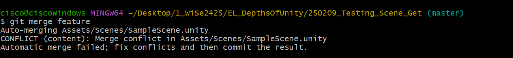
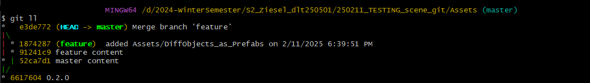

# How to Use: Scene G(i/e)t 

## 1. Changes on scene file on feature 

## 2. Changes on scene file on master

## 3. Try to merge feature in master

## 4. Switch to feature

## 5. Open Window → SceneGet_GUI

## 6. Type in branch names and press 'Start'

## 7. Automatic switch to master

## 8. Drag and drop prefabs from Assets/DiffObjects_as_Prefabs

## 9. Result in commits:

