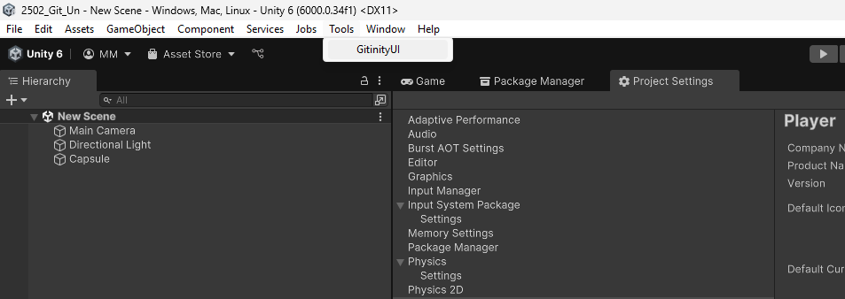
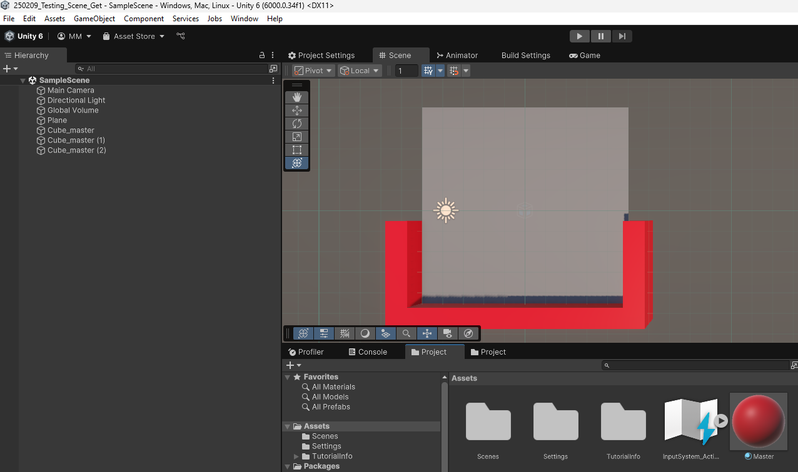
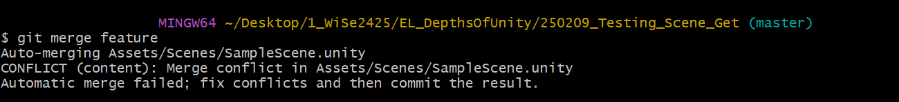
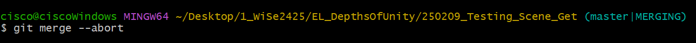
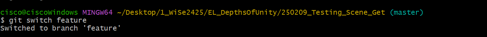
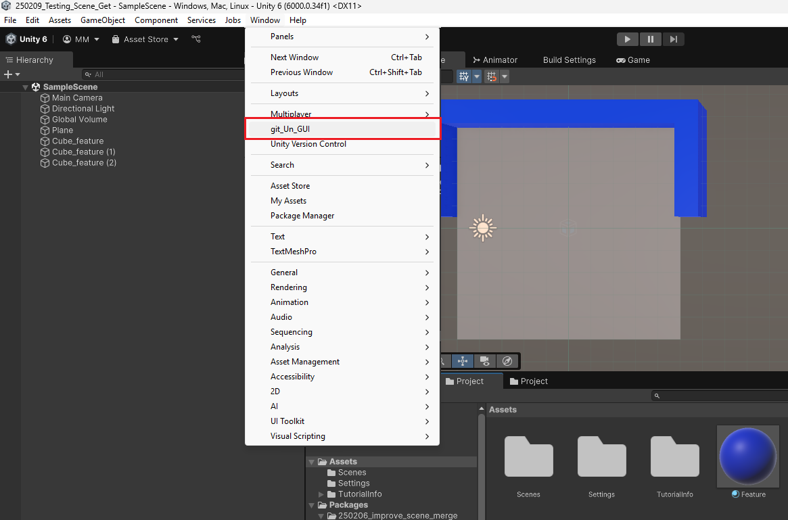
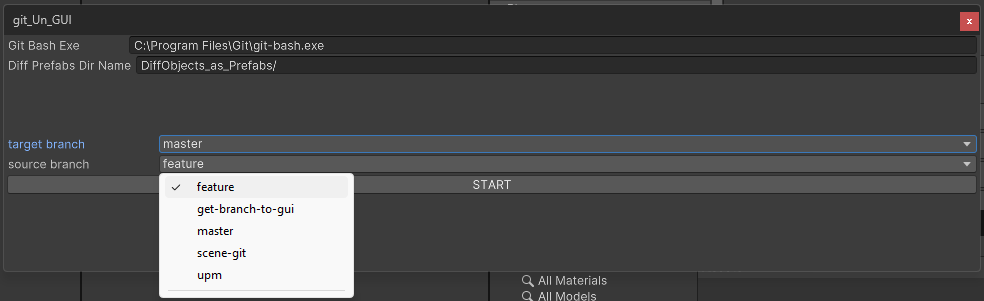
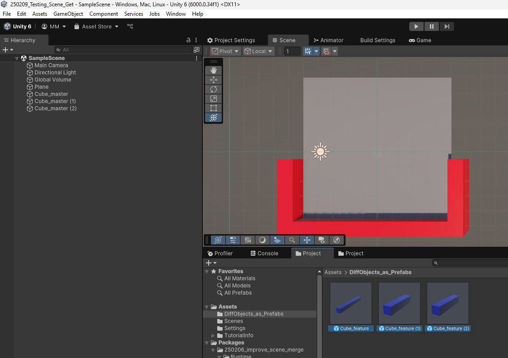
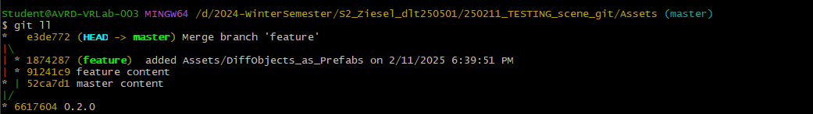

#   Gitinity - A git wrapper for Unity
(Suggestions for another name are welcome.)
### Get it with the package manager from:
``https://github.com/cisco108/2502_Git_Un.git#upm``

# Get Started:

### The gui changed and can be found under tools now:

The following example using the old Gui is still applicable.
### 1. Install git_Un to your Unity Project.
### 2. Open the git_Un GUI (Window -> git_Un_GUI)

### 3. Paste in the http link to an EMPTY (no commits) repository of your preferred hosting platform.
### 4. Press "Setup git Un"
### What happens:
- The project gets initialized as a git repository.
- A .gitignore for unity projects is added.
- The provided remote is added to the repository.
- The entire project (minus gitignored files) is pushed to the remote.
-  (An additional branch is added for managing file locking, which is not implemented yet.)
# How to Use Merge Function: 

## 1. Changes on scene file on feature

## 2. Changes on scene file on master

## 3. Try to merge feature in master

## 4. Switch to feature

## 5. Open Tools → GitinityUI 

## 6. Select target and feature branch, then press START 

### Configure path to git-bash.exe if needed.

## 7. Automatic switch to master

## 8. Drag and drop prefabs from Assets/DiffObjects_as_Prefabs

## 9. Result in commits:

## Everyone who would like to contribute to this, in which ever way, is very welcome to do so. I can imagine this becoming a cool tool.
